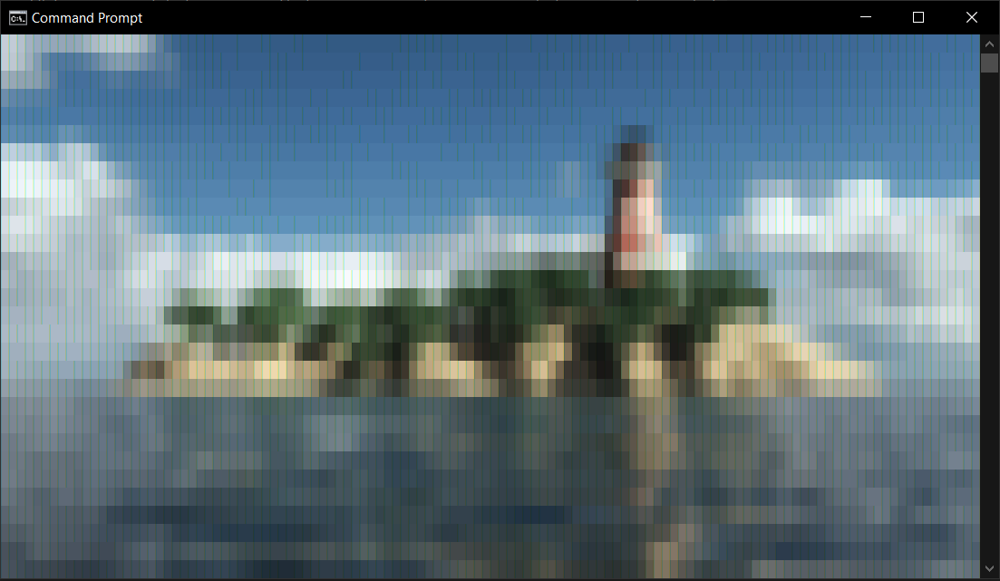
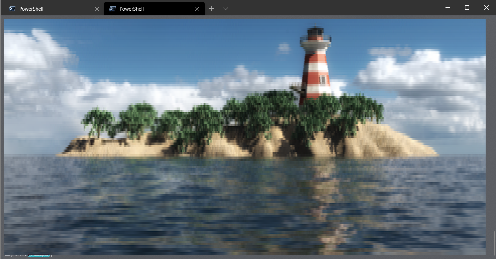

<!-- Written by Mohammad Ishrak Abedin-->
# Termimage
---
### A Terminal Image Viewer for viewing images in VT100 emulated terminals
---
### The project relies on **[PREMAKE](https://premake.github.io/)** meta build system and can be compiled in Windows or Linux using preferred build system (Expected to use MSVC for Windows and GCC for Linux).

## *Tools Used*
---
- [Premake 5.0 Alpha](https://premake.github.io/)

*Premake5 is already provided for Windows in the `premake` folder.*

## *Libraries Used*
---
+ [fmtlib 7.1.0](https://github.com/fmtlib/fmt)
+ [stb_image(_write/_resize)](https://github.com/nothings/stb)

## *Packages Required for Linux*
---
+ GCC
+ Make
+ Premake 5.0 alpha

---
**C++ 17 or Higher is Mandatory to compile since the project uses *std::filesystem*. This is currently only written for x64 systems and not tested on others.**

---
## *Building for Windows (MSVC/ Visual Studio)*
---
*Powershell scripts are provided to make the build process faster. One might need to change **Execution Policy** to execute ps1 scripts. Alternatively the scripts can be converted to **bat** or **com** files to execute in **cmd**. The Windows version is targeted towards **MSVC** using **Microsoft Visual Studio**. Visual Studio version **2017 or Higher** recommended. Becareful about the fsys namespace alias in **[ArgParser.cpp](src/ArgParser.cpp)** since C++ 2017 standard might be experimental in VS2017 and use ```std::experimental::filesystem```, but in 2019, it should use ```std::filesystem```.*

Run the following commands in step to generate project files and build the project.
```powershell
.\makedirs.ps1 # Generates output directories

.\premake\premake5.exe vs2019 # Pass respective Visual Studio version
```
*At this point, a **Visual Studio Solution** will be generated. Use it to build the project.*

> ***VS 2017** solution by **Premake5** has some **bugs** and the Windows SDK is set to 8.1 or lower version. If using **VS 2017**, **manually set Windows SDK to the latest Windows 10 one**, by going to **Project > Termimage Properties... > Configuration Properties > General > Windows SDK Version** and selecting the latest one.*

---
## *Building for Linux (GCC/ Make)*
---
*Shell Scripts are provided to make the build process faster. Install the aforementioned required packages before building.*

Run the following commands in step to generate project files and build the project.
```bash
#-- Project Generation --
sh ./makedirs.sh # Generates output directories

premake5 gmake2 # Generates Makefile

#-- Building ---
# For building in Debug Mode
make config=debug
# or
# For building in Release Mode
make config=release
```
---
## Using the Application
---
After building, the executable is located in `bin/Release/` or `bin/Debug/` based on the build configuration. The application must be supplied with an image path and there are 3 other optional arguments.

*Example for Windows*
```powershell
Termimage.exe path_to_image -w 120 -r 2.25
```

*Example for Linux*
```bash
Termimage path_to_image -w 140 -r 2.1
```

*Example of Auto Scaling Powershell Command (Works best in emulated terminals like **Windows Terminal**)*
```powershell
Termimage.exe path_to_image -w $Host.UI.RawUI.WindowSize.Width
```

*Example of Auto Scaling Bash Command*
```bash
Termimage path_to_image -w $COLUMNS
```
Similar approach is possible in other environments based on where the application is running.

### Optional arguments
+ `-w` or `--width` *width of the image*
+ `-r` or `--ratio` *compression ratio of height vs width*
+ `-h` or `--help` *bring up help*
---
## Gallery
-------
Example on CMD (Windows)

Example on Windows Terminal PSCore (Windows)
